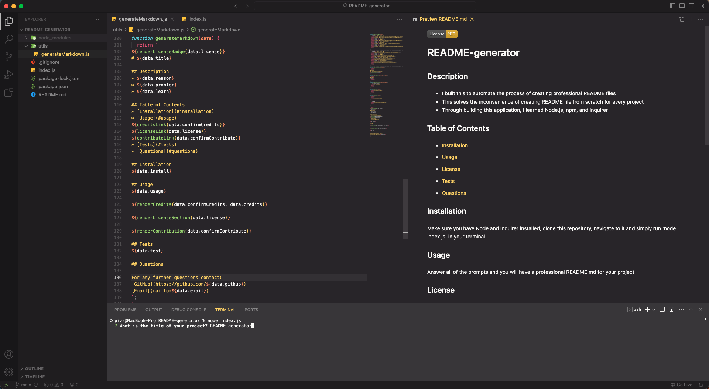

# README-generator

## Description
* I built this to automate the process of creating professional README files
* This solves the inconvenience of creating  README file from scratch for every project
* Through building this application, I learned Node.js, npm, and Inquirer

## Table of Contents
* [Installation](#installation)
* [Usage](#usage)

* [License](#license)

* [Tests](#tests)
* [Questions](#questions)

## Installation
Make sure you have Node and Inquirer installed, clone this repository, navigate to it and simply run 'node index.js' in your terminal

## Usage
Answer all of the prompts and you will have a professional README.md for your project, file will be generated in the 'dist' folder.

[Video Demo](https://drive.google.com/file/d/1Me6bQIcf6Ar74y0IEDJ3htaT0vfzFntT/view)

## License
This application is covered under:
[MIT](https://choosealicense.com/licenses/mit/)

## Tests
Test the application by updating the current README.md with your own answers

## Questions

For any further questions contact:  
[GitHub](https://github.com/BrianPizz)  
